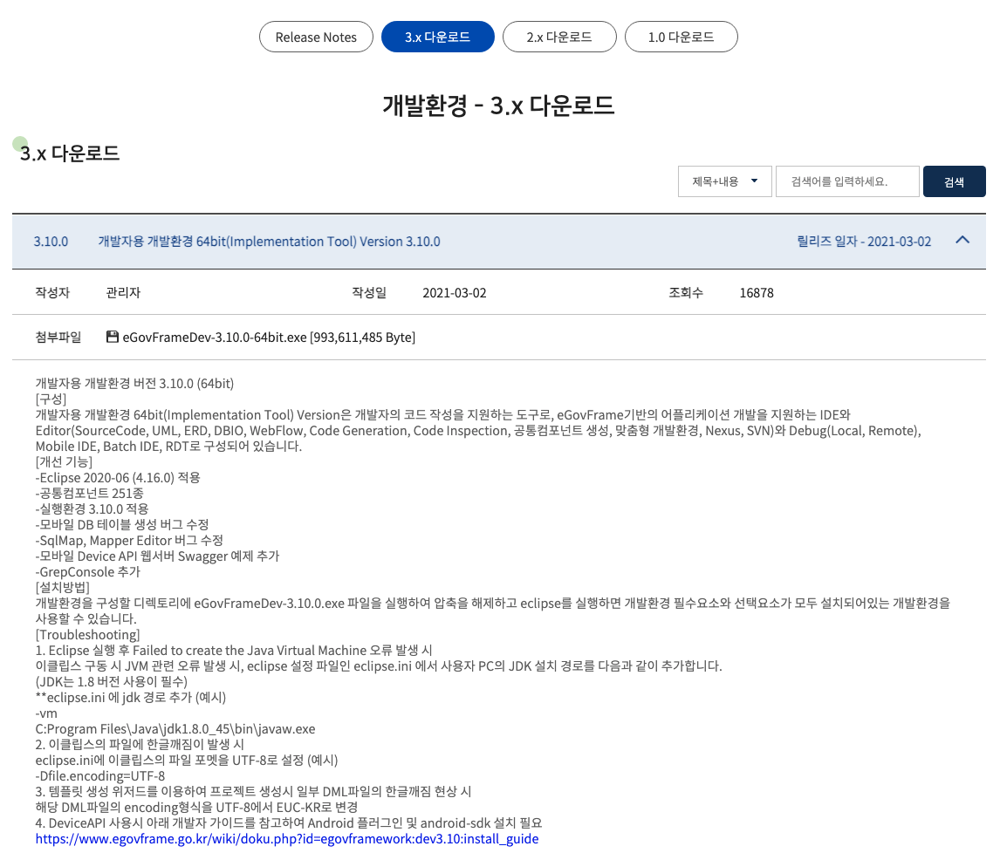
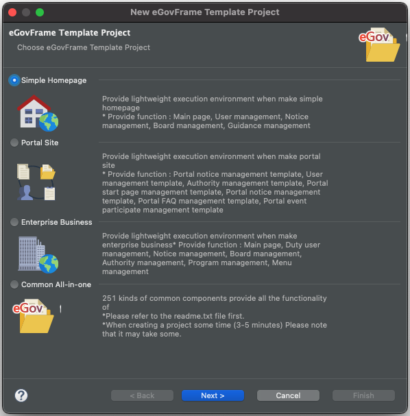
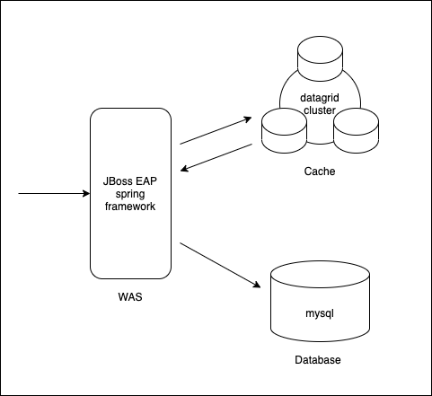
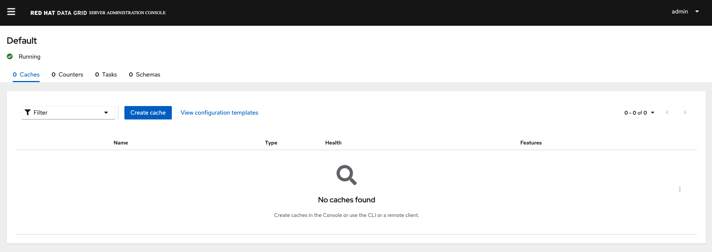
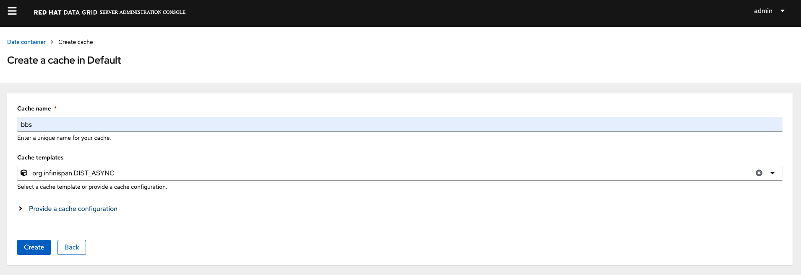
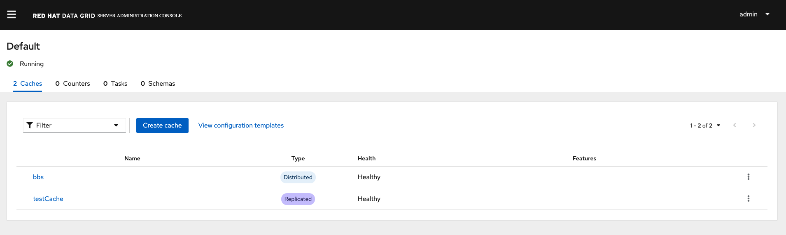
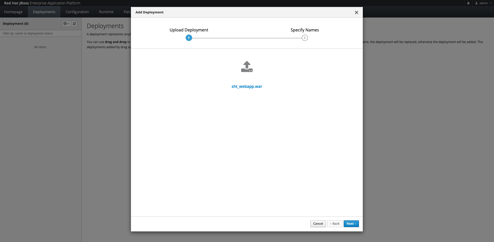
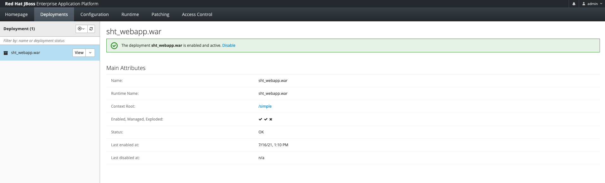
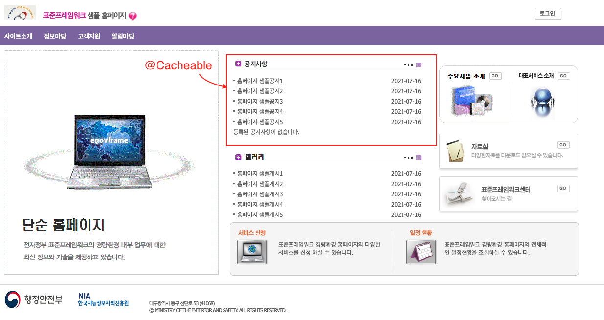

# integration_with_the_spring_framework
> Redhat Datagri에서는 spring framework 에서 Cache Service 를 사용할수 있는 라이브러리를 제공한다. 변경이 자주 일어나지 않지만 사용빈도가 높고 생성하는데 비용이 많이 드는 객체일 경우, Cache를 이용하면 다음과 같은 장점을 얻을 수 있다.
 * 애플리케이션 성능 개선
 * 데이터베이스 비용 절감
 * 백엔드 로드 감소
 * 예측 가능한 성능
 * 데이터베이스 핫스팟 제거
 * 읽기 처리량(IOPS) 증가

## 1. 전자정부프레임워크 3.10
> 본 예제는 전자정부프레임워크 3.10(Spring Framework 4.3)의  을 사용하여 작성되었다. <BR>
> 전자정부프레임워크 > 다운로드 > 개발환경 3.10.0


> 전자정부프레임워크 실행 > eGovFrame Template Project > Simple Homepage


## docker-compose 구성
> 본 예제는 docker 로 구성되어 있으며 사전에 docker, docker-compose 가 설치되어 있어야 한다. <BR>
> * JBoss EAP 7.3 1대 
> * MySQL 5.7 1대
> * Datagrid 3대
 


## docker-compose 실행

```bash
> docker-compose up -d
Creating rhdv-integration-spring_datagrid3_1 ... done
Creating rhdv-integration-spring_datagrid1_1 ... done
Creating rhdv-integration-spring_database_1  ... done
Creating rhdv-integration-spring_eap_1       ... done
Creating rhdv-integration-spring_datagrid2_1 ... done

> docker-compose ps
               Name                              Command               State                                              Ports                                            
---------------------------------------------------------------------------------------------------------------------------------------------------------------------------
rhdv-integration-spring_database_1    docker-entrypoint.sh --def ...   Up      0.0.0.0:3306->3306/tcp,:::3306->3306/tcp, 33060/tcp                                         
rhdv-integration-spring_datagrid1_1   docker-entrypoint.sh             Up      0.0.0.0:11222->11222/tcp,:::11222->11222/tcp                                                
rhdv-integration-spring_datagrid2_1   docker-entrypoint.sh             Up      0.0.0.0:11322->11222/tcp,:::11322->11222/tcp                                                
rhdv-integration-spring_datagrid3_1   docker-entrypoint.sh             Up      0.0.0.0:11422->11222/tcp,:::11422->11222/tcp                                                
rhdv-integration-spring_eap_1         docker-entrypoint.sh             Up      8009/tcp, 0.0.0.0:8080->8080/tcp,:::8080->8080/tcp, 0.0.0.0:9990->9990/tcp,:::9990->9990/tcp

docker-compose logs -f
```

## JBoss EAP 접속
> 본 예제의 Spring Framework 는 JBoss EAP 7.3 버전으로 동작한다. <BR>
> 계정정보 : admin/admin
> * JBoss EAP : http://localhost:8080

## MYSQL 접속
> 본 예제의 Database 는 MySQL 5.7 로 데이터베이스 이름은 "egov"로 구성된다. <BR>
> 계정정보 egov/egov 
```bash
docker-compose exec database mysql -u egov -p egov 
Enter password: 
```

## RHDG 접속
> 본 예제의 Datagrid 는 3개의 컨테이너로 클러스터링되어 구성된다. 
> 계정정보 admin/admin
> * datagrid1 : http://localhost:11222
> * datagrid2 : http://localhost:11322
> * datagrid3 : http://localhost:11422

> Datagrid 관리자 페이지 접속후 bbs,testCache 를 생성한다.





## maven 어플리케이션 배포/삭제
```
mvn clean wildfly:deploy -PdeployRemote 
mvn clean -PdeployRemote
```

## Jboss Console 어플리케이션 배포/삭제
> JBoss EAP 콘솔 접속 후 deployment 메뉴로 이동하여 배포파일을 업로드한다. <br>
> http://127.0.0.1:9990/console/index.html#deployments



## 전저장부프레임워크 접속
> http://127.0.0.1:8080/simple/cmm/main/mainPage.do



# Referer

## Red Hat Data Grid 8 Supported Configurations 
https://access.redhat.com/articles/4933551

## Red Hat Data Grid 7 Supported Configurations
https://access.redhat.com/articles/2435931

## Integration with Spring Framework 4 
> Redhat Data Grid 7.2 <BR>
https://access.redhat.com/documentation/en-us/red_hat_data_grid/7.2/html/developer_guide/integration_with_the_spring_framework

> Infinispan 9.4 <BR>
https://infinispan.org/docs/9.4.x/user_guide/user_guide.html#integrations_jpa_hibernate
https://github.com/infinispan/infinispan/blob/9.4.x/spring/spring5/spring5-remote/src/main/java/org/infinispan/spring/remote/provider/SpringRemoteCacheManagerFactoryBean.java

 > Spring Framework Documentation <BR>
https://docs.spring.io/spring-framework/docs/current/reference/html/integration.html
https://docs.spring.io/spring-framework/docs/4.3.25.RELEASE/spring-framework-reference/htmlsingle/#cache


## Integration with Spring Framework 5 
> Infinispan 12.1 <BR>
https://infinispan.org/docs/dev/titles/integrating/integrating.html 
https://github.com/infinispan/infinispan/blob/12.1.x/spring/spring5/spring5-remote/src/main/java/org/infinispan/spring/remote/provider/SpringRemoteCacheManagerFactoryBean.java

 > Spring Framework Documentation <BR>
https://docs.spring.io/spring-framework/docs/current/reference/html/integration.html


## Integration with Spring Boot
> Redhat Data Grid 8.2 <BR>
https://access.redhat.com/documentation/en-us/red_hat_data_grid/8.2/html/data_grid_spring_boot_starter/index

## 전자정부프레임워크 3.10 simple homepage
> https://www.egovframe.go.kr/home/main.do

## maven pom.xml
> 오픈소스 infinispan 버전 : "9.4.23.Final" <br>
> Redhat JDG 버전 : "9.4.6.Final-redhat-00002" , redhat 에서 다운로드
``` 
		<dependency>
			<groupId>org.infinispan</groupId>
			<artifactId>infinispan-spring4-remote</artifactId>
			<version>9.4.23.Final</version>
		</dependency> 
```

## Spring cacheManager
> spring cacheManager xml 설정 적용 <br>
> src/main/resources/egovframework/spring/com/context-cache.xml
```
<beans xmlns="http://www.springframework.org/schema/beans"
	xmlns:xsi="http://www.w3.org/2001/XMLSchema-instance"
	xmlns:cache="http://www.springframework.org/schema/cache"
	xmlns:p="http://www.springframework.org/schema/p"
	xsi:schemaLocation="
        http://www.springframework.org/schema/beans http://www.springframework.org/schema/beans/spring-beans.xsd
        http://www.springframework.org/schema/cache http://www.springframework.org/schema/cache/spring-cache.xsd">

	<cache:annotation-driven />

	<bean id="cacheManager"
		class="org.infinispan.spring.provider.SpringRemoteCacheManagerFactoryBean"
		p:configuration-properties-file-location="classpath:/egovframework/egovProps/hotrod-client.properties" />

</beans>
```

> Datagrid 클러스터 접속 설정 적용 <br>
> src/main/resources/egovframework/egovProps/hotrod-client.properties
```
# List Infinispan servers by IP address or hostname at port 11222.
infinispan.client.hotrod.server_list=datagrid1:11222;datagrid2:11222;datagrid3:11222;

# Use BASIC client intelligence.
infinispan.client.hotrod.client_intelligence=BASIC

# Authentication
infinispan.client.hotrod.use_auth=true
infinispan.client.hotrod.auth_username=admin
infinispan.client.hotrod.auth_password=admin
infinispan.client.hotrod.auth_realm=default
infinispan.client.hotrod.sasl_mechanism=SCRAM-SHA-512

infinispan.spring.operation.read.timeout=500
infinispan.spring.operation.read.timeout=700
```

> JBoss EAP 7 사용시 에러 발생 : <br>
> java.lang.NoClassDefFoundError: sun/reflect/ReflectionFactory
> WEB-INF/jboss-deployment-structure.xml
```
<jboss-deployment-structure xmlns="urn:jboss:deployment-structure:1.1">
    <deployment>
        <dependencies>
            <system export="true">
                <paths>
                    <path name="sun/reflect"/>
                </paths>
            </system>
        </dependencies>
    </deployment>
</jboss-deployment-structure>
```

# 어플리케이션에 Cache 적용하기

## 1. 메인 Service 공지사항 Cache 추가
> /simple/src/main/java/egovframework/let/cop/bbs/service/impl/EgovBBSManageService.java <BR>
> /simple/src/main/java/egovframework/let/cop/bbs/service/impl/EgovBBSManageServiceImpl.java  <BR>
> selectBoardArticles -> selectBoardCache  <BR>

> @Cacheable(cacheNames = "bbs", key = "#boardVO") 어노테이션 추가 <BR>
> * cacheName : Datagrid cache Name 
> * key : cache key
```
    @Cacheable(cacheNames = "bbs", key = "#boardVO")
	public Map<String, Object> selectBoardCache(BoardVO boardVO, String attrbFlag) throws Exception {

		long start = System.currentTimeMillis();

		List<BoardVO> list = bbsMngDAO.selectBoardArticleList(boardVO);
		List<BoardVO> result = new ArrayList<BoardVO>();

		if ("BBSA01".equals(attrbFlag)) {
			// 유효게시판 임
			String today = EgovDateUtil.getToday();

			BoardVO vo;
			Iterator<BoardVO> iter = list.iterator();
			while (iter.hasNext()) {
				vo = (BoardVO) iter.next();

				if (!"".equals(vo.getNtceBgnde()) || !"".equals(vo.getNtceEndde())) {
					if (EgovDateUtil.getDaysDiff(today, vo.getNtceBgnde()) > 0
							|| EgovDateUtil.getDaysDiff(today, vo.getNtceEndde()) < 0) {
						// 시작일이 오늘날짜보다 크거나, 종료일이 오늘 날짜보다 작은 경우
						vo.setIsExpired("Y");
					}
				}
				result.add(vo);
			}
		} else {
			result = list;
		}

		int cnt = bbsMngDAO.selectBoardArticleListCnt(boardVO);

		Map<String, Object> map = new HashMap<String, Object>();

		long end = System.currentTimeMillis();

		System.out.println("------------ CacheVo : " + result + ", " + (end - start) + " ms");

		map.put("resultList", result);
		map.put("resultCnt", Integer.toString(cnt));

		return map;
	}
```

## 2. 메인 Controller 공지사항 Cache 서비스 호출  
> /simple/src/main/java/egovframework/let/main/web/EgovMainController.java
```
		// map = bbsMngService.selectBoardCache(boardVO, "BBSA02");
        ->
		map = bbsMngService.selectBoardCache(boardVO, "BBSA02");
		model.addAttribute("notiList", map.get("resultList"));
```
 
> 메인페이지 최초 호출시 디비에서 호회후 Datagrid 에 입력 Datagrid bbs Cache 조회시 BoardVO 오브젝트 확인.
Datagrid bbs Cache 가 삭제되기 전까지 DB 호출 없이 Datagrid 에서 호출함.


## 3. 기타 테스트
> 임의의 repository 생성후 cache 테스트 진행 <br> 
>  getData, evictCache
```
package egovframework.datagrid;

import java.util.UUID;

import org.springframework.cache.annotation.CacheEvict;
import org.springframework.cache.annotation.Cacheable;
import org.springframework.stereotype.Repository;

@Repository
public class DatagridRepository {

	@Cacheable(cacheNames = "testCache", key = "#id")
	public String getData(int id) {
		UUID uuid = UUID.randomUUID();

		try {
			Thread.sleep(5000);
		} catch (InterruptedException e) {
			// TODO Auto-generated catch block
			e.printStackTrace();
		}

		return "test-data-" + uuid;
	}

	@CacheEvict(cacheNames = "testCache", key = "#id")
	public void evictCache(int id) {
		System.out.println("delete cache " + id);
	}

	@CacheEvict(cacheNames = "testCache", allEntries = true)
	public void evictCache() {
		System.out.println("delete cache all");
	}
}

```